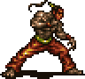

  

<h1 align="center">FF6 Pixel Remaster — Gau Rage Checklist</h1>

  An interactive browser-based checklist for tracking Gau's Rages in
  <strong>Final Fantasy VI Pixel Remaster</strong>.

  <a href="https://felipechalreo.github.io/ff6-gau-rage-checklist/">
    <strong>▶ Open the Live Checklist</strong>
  </a>

## Preview

## Features

- All 252 obtainable Rages
- Same ordering used by Gau's in-game Rage menu
- Search by enemy name or Rage ability
- Filters for owned and missing Rages
- Bestiary progress limit to hide later encounters
- Separate controls for bosses and unnumbered enemies
- Subtle separators matching each 7-row in-game menu page
- Progress saved automatically in the browser
- Works offline as a single HTML file
- No account, installation, or server required

## How to Use

1. Open the checklist.
2. Enter the highest regular Bestiary number you have unlocked, if desired.
3. Enable any relevant bosses or unnumbered enemies you have encountered.
4. Check each Rage that Gau has learned.
5. Use the **Missing only** filter while hunting on the Veldt.

Your progress is stored locally in your browser using `localStorage`.

## Important Note

The Bestiary limit is a convenience filter.

Actual Veldt availability depends on which enemy formations have been encountered in the current save file. A Bestiary number alone does not guarantee that every earlier formation is available on the Veldt.

## Offline Use

Download `index.html` and open it in any modern browser.

The checklist does not require an internet connection after the file has been downloaded.

## Feedback and Corrections

Found an incorrect enemy name, Rage ability, menu position, or availability rule?

[Report an issue](https://github.com/felipechalreo/ff6-gau-rage-checklist/issues)

## Disclaimer

This is an unofficial fan-made project and is not affiliated with or endorsed by Square Enix.

FINAL FANTASY, FINAL FANTASY VI, and related names, characters, images, and trademarks belong to their respective owners.

The Zaghrem sprite shown in this repository is used for identification and presentation in connection with this non-commercial fan project.

## License

The original source code for this tool is available under the [MIT License](LICENSE).
